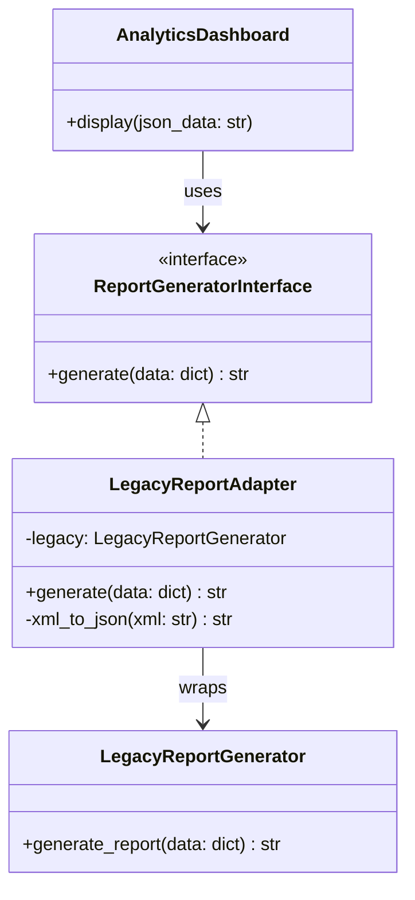

```mermaid
classDiagram

class ReportGeneratorInterface {
    <<interface>>
    +generate(data: dict) str
}

class LegacyReportGenerator {
    +generate_report(data: dict) str
}

class LegacyReportAdapter {
    -legacy: LegacyReportGenerator
    +generate(data: dict) str
    -xml_to_json(xml: str) str
}

class AnalyticsDashboard {
    +display(json_data: str)
}

ReportGeneratorInterface <|.. LegacyReportAdapter
LegacyReportAdapter --> LegacyReportGenerator : wraps
AnalyticsDashboard --> ReportGeneratorInterface : uses
```
