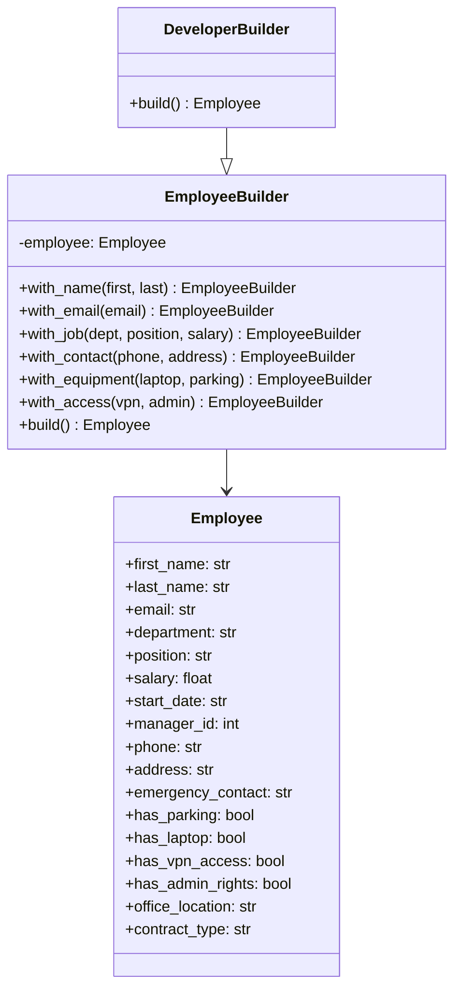

```mermaid
classDiagram

class Employee {
    +first_name: str
    +last_name: str
    +email: str
    +department: str
    +position: str
    +salary: float
    +start_date: str
    +manager_id: int
    +phone: str
    +address: str
    +emergency_contact: str
    +has_parking: bool
    +has_laptop: bool
    +has_vpn_access: bool
    +has_admin_rights: bool
    +office_location: str
    +contract_type: str
}

class EmployeeBuilder {
    -employee: Employee
    +with_name(first, last) EmployeeBuilder
    +with_email(email) EmployeeBuilder
    +with_job(dept, position, salary) EmployeeBuilder
    +with_contact(phone, address) EmployeeBuilder
    +with_equipment(laptop, parking) EmployeeBuilder
    +with_access(vpn, admin) EmployeeBuilder
    +build() Employee
}

class DeveloperBuilder {
    +build() Employee
}

EmployeeBuilder --> Employee
DeveloperBuilder --|> EmployeeBuilder
```
