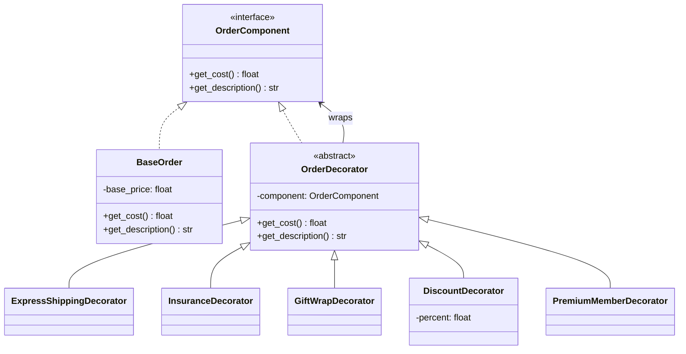

```mermaid
classDiagram

class OrderComponent {
    <<interface>>
    +get_cost() float
    +get_description() str
}

class BaseOrder {
    -base_price: float
    +get_cost() float
    +get_description() str
}

class OrderDecorator {
    <<abstract>>
    -component: OrderComponent
    +get_cost() float
    +get_description() str
}

class ExpressShippingDecorator
class InsuranceDecorator
class GiftWrapDecorator
class DiscountDecorator {
    -percent: float
}
class PremiumMemberDecorator

OrderComponent <|.. BaseOrder
OrderComponent <|.. OrderDecorator

OrderDecorator <|-- ExpressShippingDecorator
OrderDecorator <|-- InsuranceDecorator
OrderDecorator <|-- GiftWrapDecorator
OrderDecorator <|-- DiscountDecorator
OrderDecorator <|-- PremiumMemberDecorator

OrderDecorator --> OrderComponent : wraps
```
