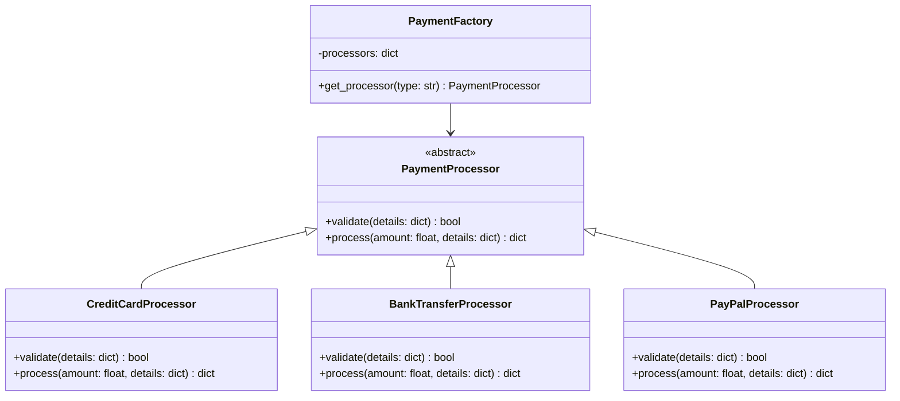

```mermaid
classDiagram

class PaymentProcessor {
    <<abstract>>
    +validate(details: dict) bool
    +process(amount: float, details: dict) dict
}

class CreditCardProcessor {
    +validate(details: dict) bool
    +process(amount: float, details: dict) dict
}

class BankTransferProcessor {
    +validate(details: dict) bool
    +process(amount: float, details: dict) dict
}

class PayPalProcessor {
    +validate(details: dict) bool
    +process(amount: float, details: dict) dict
}

class PaymentFactory {
    -processors: dict
    +get_processor(type: str) PaymentProcessor
}

PaymentProcessor <|-- CreditCardProcessor
PaymentProcessor <|-- BankTransferProcessor
PaymentProcessor <|-- PayPalProcessor

PaymentFactory --> PaymentProcessor
```
