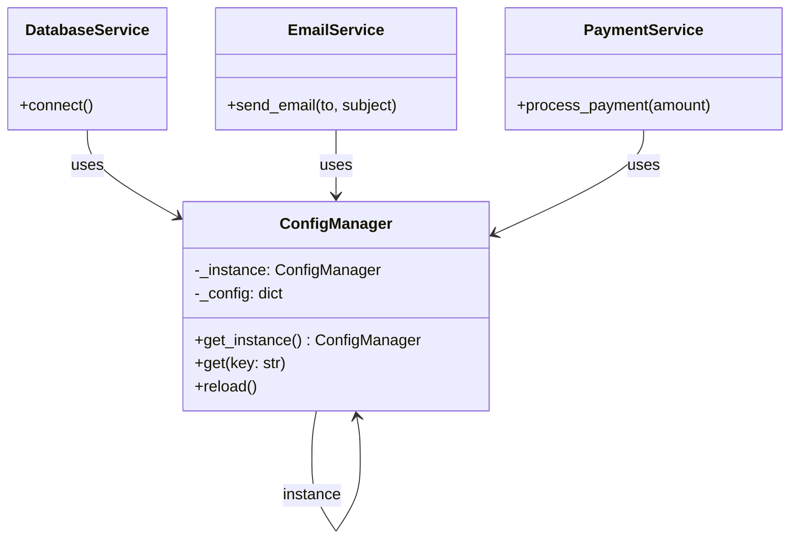

```mermaid
classDiagram

class ConfigManager {
    -_instance: ConfigManager
    -_config: dict
    +get_instance() ConfigManager
    +get(key: str)
    +reload()
}

class DatabaseService {
    +connect()
}

class EmailService {
    +send_email(to, subject)
}

class PaymentService {
    +process_payment(amount)
}

%% Singleton self-reference
ConfigManager --> ConfigManager : instance

%% Uses relationships
DatabaseService --> ConfigManager : uses
EmailService --> ConfigManager : uses
PaymentService --> ConfigManager : uses
```
