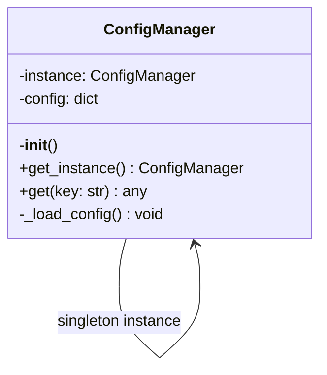

```mermaid
classDiagram

class ConfigManager {
    -instance: ConfigManager
    -config: dict
    -__init__()
    +get_instance() ConfigManager
    +get(key: str) any
    -_load_config() void
}

ConfigManager --> ConfigManager : singleton instance
```
