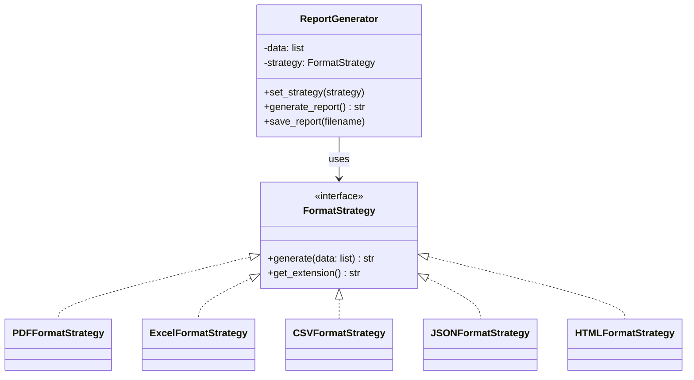

```mermaid
classDiagram

class FormatStrategy {
    <<interface>>
    +generate(data: list) str
    +get_extension() str
}

class PDFFormatStrategy
class ExcelFormatStrategy
class CSVFormatStrategy
class JSONFormatStrategy
class HTMLFormatStrategy

class ReportGenerator {
    -data: list
    -strategy: FormatStrategy
    +set_strategy(strategy)
    +generate_report() str
    +save_report(filename)
}

FormatStrategy <|.. PDFFormatStrategy
FormatStrategy <|.. ExcelFormatStrategy
FormatStrategy <|.. CSVFormatStrategy
FormatStrategy <|.. JSONFormatStrategy
FormatStrategy <|.. HTMLFormatStrategy

ReportGenerator --> FormatStrategy : uses
```
