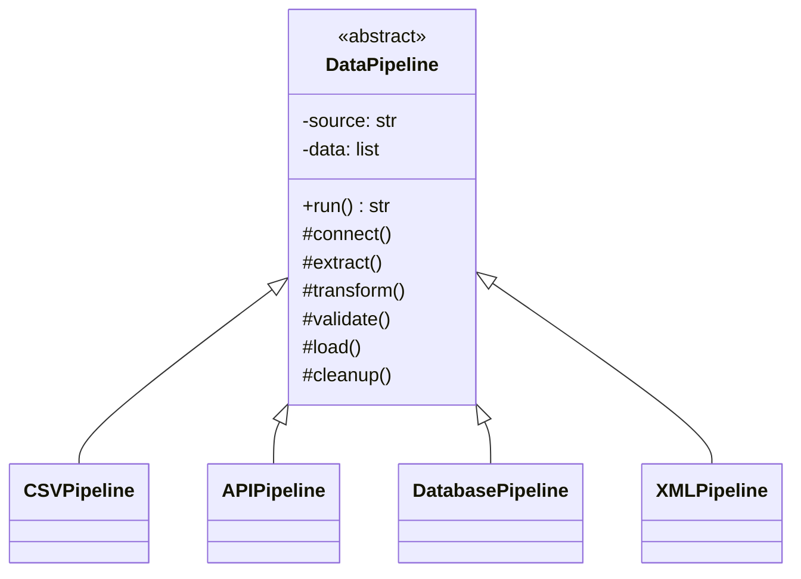

```mermaid
classDiagram

class DataPipeline {
    <<abstract>>
    -source: str
    -data: list
    +run() str
    #connect()
    #extract()
    #transform()
    #validate()
    #load()
    #cleanup()
}

class CSVPipeline
class APIPipeline
class DatabasePipeline
class XMLPipeline

DataPipeline <|-- CSVPipeline
DataPipeline <|-- APIPipeline
DataPipeline <|-- DatabasePipeline
DataPipeline <|-- XMLPipeline
```
