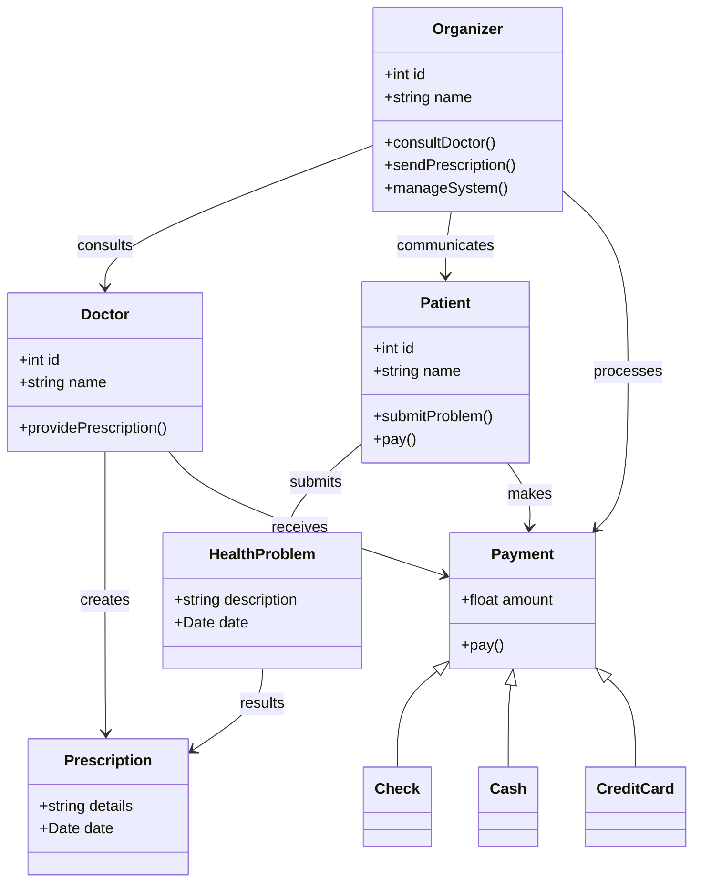
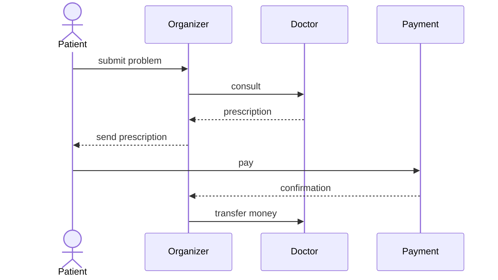

```mermaid
classDiagram

class Patient {
  +int id
  +string name
  +submitProblem()
  +pay()
}

class Organizer {
  +int id
  +string name
  +consultDoctor()
  +sendPrescription()
  +manageSystem()
}

class Doctor {
  +int id
  +string name
  +providePrescription()
}

class HealthProblem {
  +string description
  +Date date
}

class Prescription {
  +string details
  +Date date
}

class Payment {
  +float amount
  +pay()
}

class Check
class Cash
class CreditCard

Patient --> HealthProblem : submits
HealthProblem --> Prescription : results
Doctor --> Prescription : creates
Organizer --> Doctor : consults
Organizer --> Patient : communicates

Patient --> Payment : makes
Organizer --> Payment : processes
Doctor --> Payment : receives

Payment <|-- Check
Payment <|-- Cash
Payment <|-- CreditCard
```

```mermaid
sequenceDiagram

actor Patient
participant Organizer
participant Doctor
participant Payment

Patient ->> Organizer : submit problem
Organizer ->> Doctor : consult
Doctor -->> Organizer : prescription
Organizer -->> Patient : send prescription

Patient ->> Payment : pay
Payment -->> Organizer : confirmation
Organizer ->> Doctor : transfer money
```
