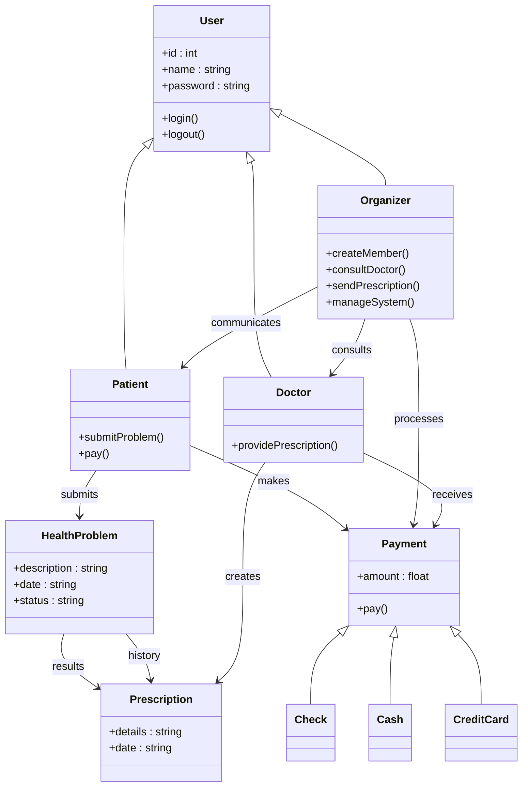
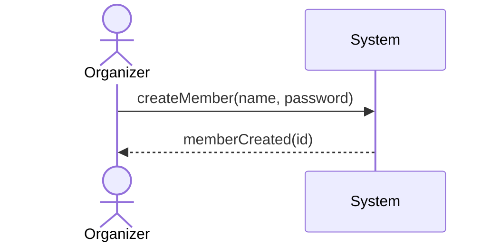
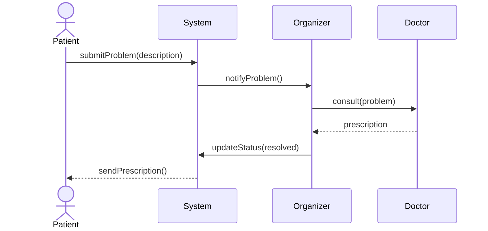
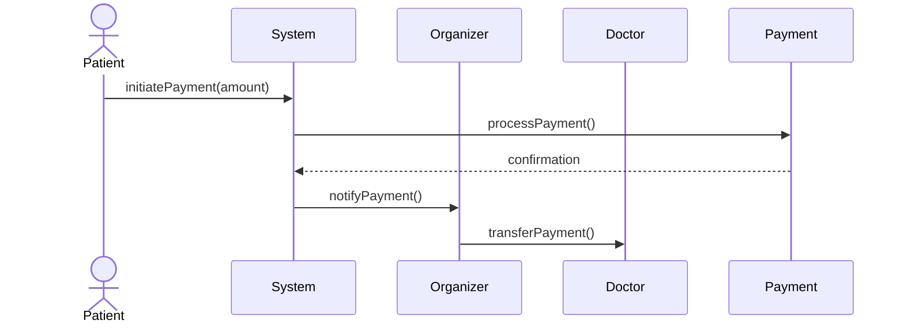

## Class Diagram

```mermaid
classDiagram

class User {
  +id : int
  +name : string
  +password : string
  +login()
  +logout()
}

class Patient {
  +submitProblem()
  +pay()
}

class Organizer {
  +createMember()
  +consultDoctor()
  +sendPrescription()
  +manageSystem()
}

class Doctor {
  +providePrescription()
}

User <|-- Patient
User <|-- Organizer
User <|-- Doctor

class HealthProblem {
  +description : string
  +date : string
  +status : string
}

class Prescription {
  +details : string
  +date : string
}

class Payment {
  +amount : float
  +pay()
}

class Check
class Cash
class CreditCard

Payment <|-- Check
Payment <|-- Cash
Payment <|-- CreditCard

Patient --> HealthProblem : submits
HealthProblem --> Prescription : results
HealthProblem --> Prescription : history
Doctor --> Prescription : creates
Organizer --> Doctor : consults
Organizer --> Patient : communicates

Patient --> Payment : makes
Organizer --> Payment : processes
Doctor --> Payment : receives
```

## System Sequence Diagram 1: Patient Registration

```mermaid
sequenceDiagram

actor Organizer
participant System

Organizer ->> System : createMember(name, password)
System -->> Organizer : memberCreated(id)
```

## System Sequence Diagram 2: Consultation Flow

```mermaid
sequenceDiagram

actor Patient
participant System
participant Organizer
participant Doctor

Patient ->> System : submitProblem(description)
System ->> Organizer : notifyProblem()

Organizer ->> Doctor : consult(problem)
Doctor -->> Organizer : prescription

Organizer ->> System : updateStatus(resolved)
System -->> Patient : sendPrescription()
```

## System Sequence Diagram 3: Payment Processing

```mermaid
sequenceDiagram

actor Patient
participant System
participant Organizer
participant Doctor
participant Payment

Patient ->> System : initiatePayment(amount)
System ->> Payment : processPayment()

Payment -->> System : confirmation
System ->> Organizer : notifyPayment()

Organizer ->> Doctor : transferPayment()
```

