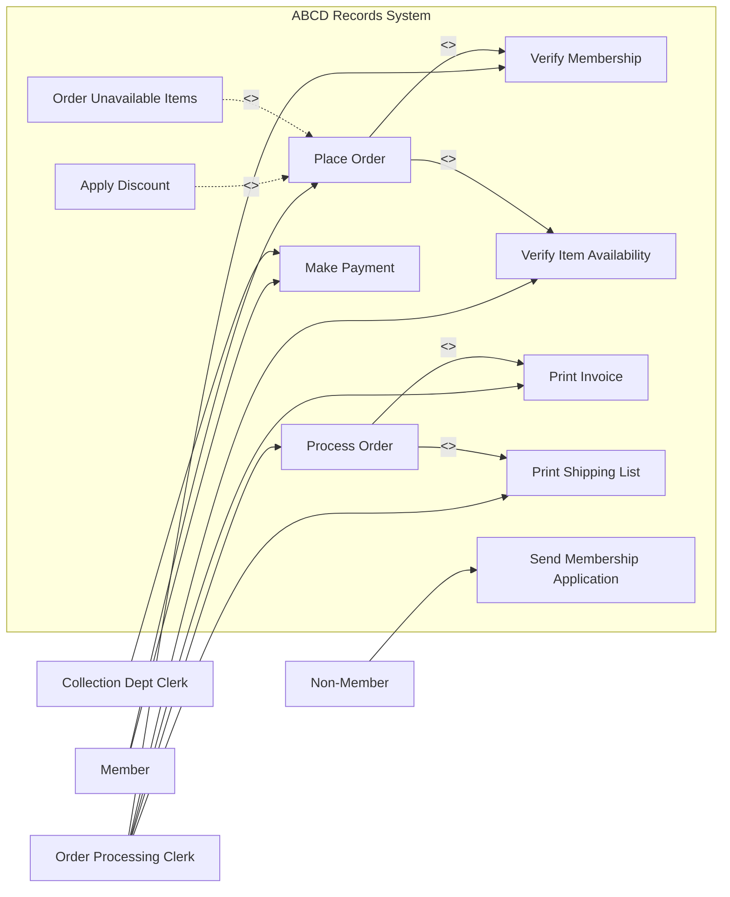
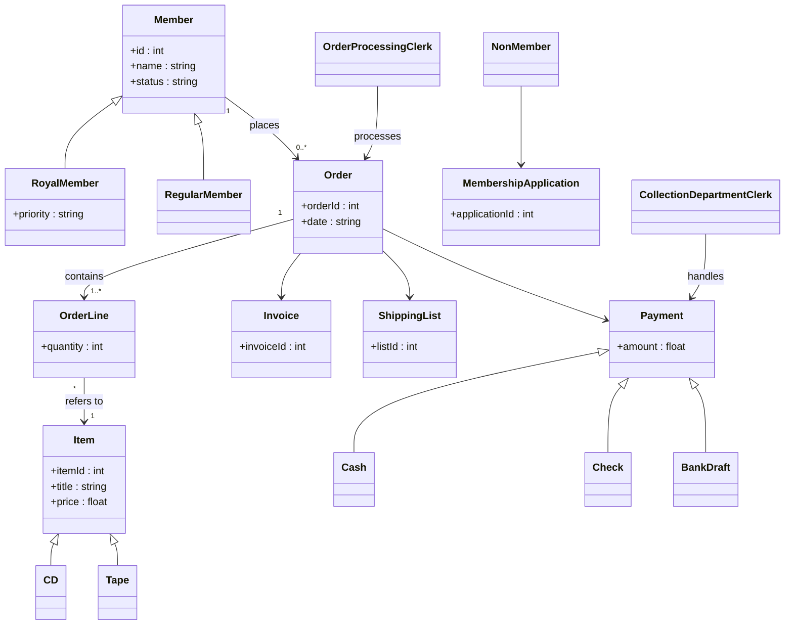
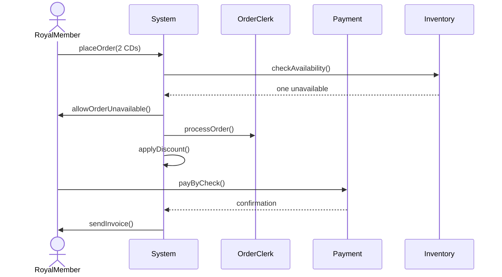

## Task 2.1 : Complete Use Case Diagram

```mermaid
flowchart LR

subgraph System [ABCD Records System]

UC1[Place Order]
UC2[Verify Membership]
UC3[Process Order]
UC4[Make Payment]
UC5[Verify Item Availability]
UC6[Apply Discount]
UC7[Print Invoice]
UC8[Print Shipping List]
UC9[Order Unavailable Items]
UC10[Send Membership Application]

end

Member --> UC1
Member --> UC4

NonMember[Non-Member] --> UC10

OrderClerk[Order Processing Clerk] --> UC2
OrderClerk --> UC3
OrderClerk --> UC5
OrderClerk --> UC7
OrderClerk --> UC8

CollectionClerk[Collection Dept Clerk] --> UC4

UC1 -->|<<include>>| UC2
UC1 -->|<<include>>| UC5
UC3 -->|<<include>>| UC7
UC3 -->|<<include>>| UC8

UC6 -.->|<<extend>>| UC1
UC9 -.->|<<extend>>| UC1
```

## Task 2.2 : Complete Class Diagram

```mermaid
classDiagram

class Member {
  +id : int
  +name : string
  +status : string
}

class RoyalMember {
  +priority : string
}

class RegularMember

Member <|-- RoyalMember
Member <|-- RegularMember

class Order {
  +orderId : int
  +date : string
}

class OrderLine {
  +quantity : int
}

class Item {
  +itemId : int
  +title : string
  +price : float
}

class CD
class Tape

Item <|-- CD
Item <|-- Tape

class Invoice {
  +invoiceId : int
}

class ShippingList {
  +listId : int
}

class Payment {
  +amount : float
}

class Cash
class Check
class BankDraft

Payment <|-- Cash
Payment <|-- Check
Payment <|-- BankDraft

class MembershipApplication {
  +applicationId : int
}

class OrderProcessingClerk
class CollectionDepartmentClerk

Member "1" --> "0..*" Order : places
Order "1" --> "1..*" OrderLine : contains
OrderLine "*" --> "1" Item : refers to

Order --> Invoice
Order --> ShippingList

Order --> Payment

OrderProcessingClerk --> Order : processes
CollectionDepartmentClerk --> Payment : handles

NonMember --> MembershipApplication
```

## Sequence Diagram

```mermaid
sequenceDiagram

actor RoyalMember
participant System
participant OrderClerk
participant Payment
participant Inventory

RoyalMember ->> System : placeOrder(2 CDs)

System ->> Inventory : checkAvailability()
Inventory -->> System : one unavailable

System ->> RoyalMember : allowOrderUnavailable()

System ->> OrderClerk : processOrder()

System ->> System : applyDiscount()

RoyalMember ->> Payment : payByCheck()
Payment -->> System : confirmation

System ->> RoyalMember : sendInvoice()
```

