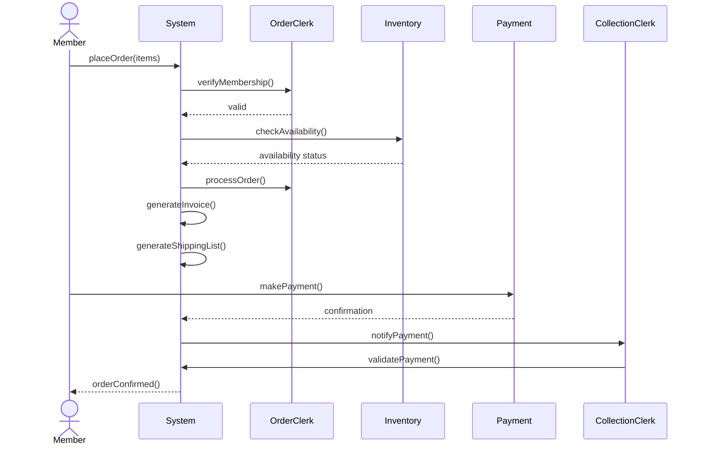
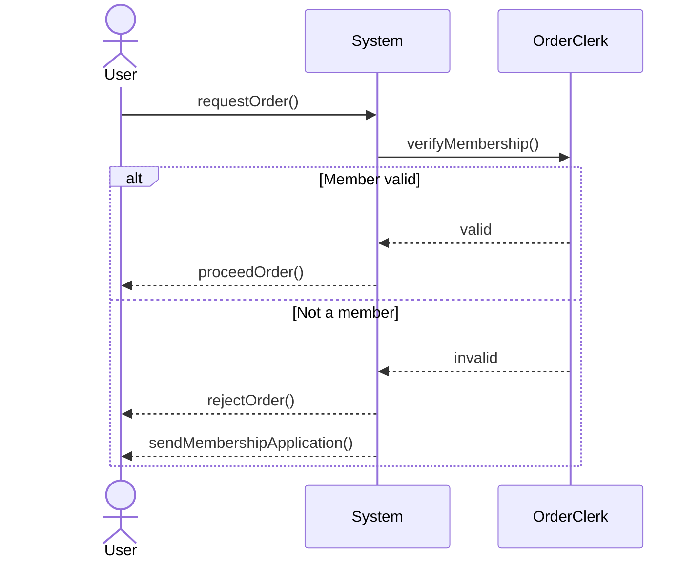
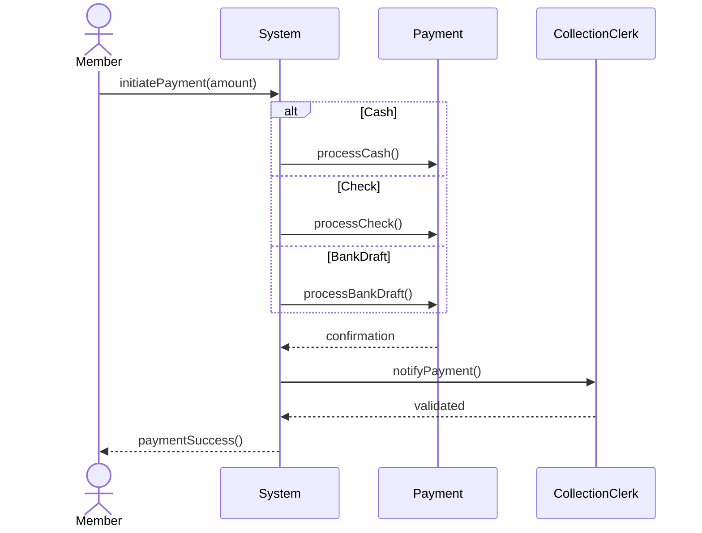
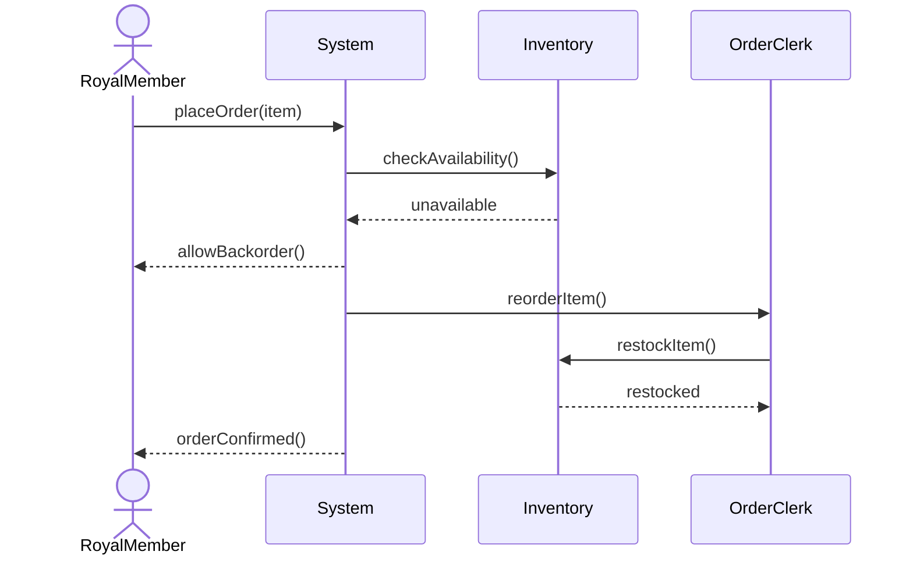

## Complete Order Processing Flow

```mermaid
sequenceDiagram

actor Member
participant System
participant OrderClerk
participant Inventory
participant Payment
participant CollectionClerk

Member ->> System : placeOrder(items)

System ->> OrderClerk : verifyMembership()
OrderClerk -->> System : valid

System ->> Inventory : checkAvailability()
Inventory -->> System : availability status

System ->> OrderClerk : processOrder()

System ->> System : generateInvoice()
System ->> System : generateShippingList()

Member ->> Payment : makePayment()
Payment -->> System : confirmation

System ->> CollectionClerk : notifyPayment()
CollectionClerk ->> System : validatePayment()

System -->> Member : orderConfirmed()
```

## Membership Verification (Success & Failure)

```mermaid
sequenceDiagram

actor User
participant System
participant OrderClerk

User ->> System : requestOrder()

System ->> OrderClerk : verifyMembership()

alt Member valid
    OrderClerk -->> System : valid
    System -->> User : proceedOrder()

else Not a member
    OrderClerk -->> System : invalid
    System -->> User : rejectOrder()
    System -->> User : sendMembershipApplication()
end
```

## Payment Processing (All Types)

```mermaid
sequenceDiagram

actor Member
participant System
participant Payment
participant CollectionClerk

Member ->> System : initiatePayment(amount)

alt Cash
    System ->> Payment : processCash()

else Check
    System ->> Payment : processCheck()

else BankDraft
    System ->> Payment : processBankDraft()
end

Payment -->> System : confirmation

System ->> CollectionClerk : notifyPayment()
CollectionClerk -->> System : validated

System -->> Member : paymentSuccess()
```

## Item Reordering (Royal Members Only)

```mermaid
sequenceDiagram

actor RoyalMember
participant System
participant Inventory
participant OrderClerk

RoyalMember ->> System : placeOrder(item)

System ->> Inventory : checkAvailability()
Inventory -->> System : unavailable

System -->> RoyalMember : allowBackorder()

System ->> OrderClerk : reorderItem()

OrderClerk ->> Inventory : restockItem()
Inventory -->> OrderClerk : restocked

System -->> RoyalMember : orderConfirmed()
```

